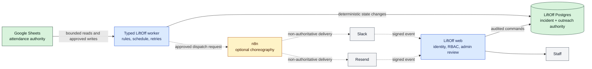
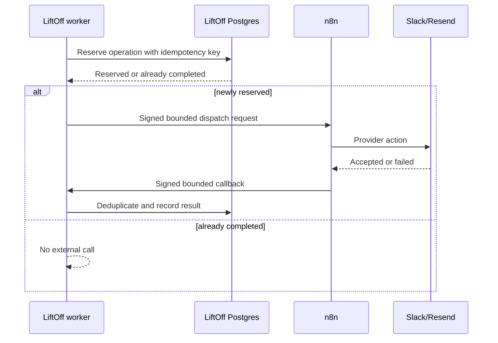

# n8n for LiftOff: architecture evaluation and adoption guide

Status: recommendation for review; no n8n integration authorized or performed

Reviewed: 2026-07-20
Decision confidence: **90% for the architecture recommendation; 40% for the existing n8n server's readiness until it is audited**

## Executive decision

Use a **hybrid architecture**:

- Keep LiftOff's typed worker and Postgres model responsible for schedules, attendance transitions, incident state, retries, idempotency, reconciliation, access control, and audit history.
- Consider n8n for non-authoritative provider choreography: staff-only notifications, operational alerts, delivery handoffs, and later integrations whose failure cannot change attendance or incident truth.
- Do not replace the current Slack Gate 5 implementation during validation. Creating a Slack app, selecting scopes, mapping identities, protecting secrets, and proving signed events are required whether Slack calls LiftOff or n8n.
- Do not give n8n direct write access to LiftOff's application tables or the authoritative attendance workbook.

The existing n8n server lowers hosting effort, but it does not remove the need for environment separation, credential governance, idempotency, data minimization, tests, or recovery evidence.

## The one-picture answer



The dotted paths are replaceable integration mechanics. The solid paths are business-authority boundaries and should remain typed, tested application behavior.

## What the project actually has today

The repository is not primarily a collection of custom APIs. It has:

- Seven direct HTTP endpoint modules: Google sign-in, callback, logout, health, CSV reporting, Slack webhook, and Resend webhook.
- Three authenticated SvelteKit form-action surfaces for learner, operations, and automation work.
- A durable worker with deterministic jobs, claim/recovery behavior, dry-run controls, retries, reconciliation, and audit persistence.
- Postgres authority for incidents and outreach, and Google Sheets authority for attendance.

Most form actions are application behavior, not generic integration glue. Moving them to n8n would reproduce authentication, cohort authorization, validation, transactions, and audit logic outside the application.

### Endpoint disposition

| Current surface                        | Keep in LiftOff?                | n8n opportunity                                           | Reason                                                                                                                                                             |
| -------------------------------------- | ------------------------------- | --------------------------------------------------------- | ------------------------------------------------------------------------------------------------------------------------------------------------------------------ |
| Google OAuth start/callback/logout     | Yes                             | None                                                      | Security boundary tied to application sessions and provisioned roles.                                                                                              |
| Health endpoint                        | Yes                             | n8n may monitor it                                        | The service must report its own health.                                                                                                                            |
| Learner form actions                   | Yes                             | None                                                      | Contains identity, submission, revision, and audit rules.                                                                                                          |
| Staff operations actions               | Yes                             | Optional notification after success                       | Contains RBAC, cohort scope, transactions, and sensitive review state.                                                                                             |
| Automation controls                    | Yes                             | Optional operational alert after a change                 | Controls modes, templates, mappings, blackouts, reviews, and archival.                                                                                             |
| CSV report                             | Yes                             | n8n may schedule delivery of an already authorized export | LiftOff must enforce report scope and field exclusions.                                                                                                            |
| Slack webhook                          | Keep for Gate 5                 | Possible later ingress proxy                              | n8n supports Slack triggers and signature verification, but proxying still requires an authenticated LiftOff ingestion endpoint and adds another failure boundary. |
| Resend webhook                         | Keep for Gate 6                 | Possible later ingress proxy                              | LiftOff already has typed signature, replay, deduplication, and status logic.                                                                                      |
| Slack/Resend outbound adapters         | Keep through initial activation | Strongest later n8n candidate                             | n8n has built-in provider nodes, but LiftOff must reserve operations and own idempotency and results.                                                              |
| Attendance scheduler and state machine | Yes                             | No                                                        | Timing, transitions, corrections, retries, and duplicate prevention are core domain behavior.                                                                      |
| Sheet reconciliation and writes        | Yes                             | No direct access                                          | Google Sheets is authoritative and requires cell-scoped conflict handling.                                                                                         |

## Options compared

Scores use 1 (poor) through 5 (strong) against LiftOff's approved requirements.

| Criterion                           |        Typed worker |        n8n replacement |                            Hybrid |
| ----------------------------------- | ------------------: | ---------------------: | --------------------------------: |
| Deterministic business rules        |                   5 |                      2 |                                 5 |
| Idempotency and concurrency control |                   5 |                      2 |                                 5 |
| Provider integration speed          |                   3 |                      5 |                                 5 |
| Staff visibility into workflows     |                   2 |                      5 |                                 4 |
| Testability in CI                   |                   5 |                      2 |                                 4 |
| Dev/UAT/Production promotion        |                   5 | 2–4, license-dependent |                                 4 |
| Data minimization                   |                   5 |                      2 |                                 4 |
| Operational simplicity              |                   4 |                      3 |                                 3 |
| Recovery and audit fit              |                   5 |                      2 |                                 5 |
| Near-term Gate 5 delivery risk      |                   5 |                      1 |                                 5 |
| **Overall recommendation**          | **Strong baseline** |             **Reject** | **Adopt selectively after audit** |

The n8n replacement score is not a criticism of n8n. It reflects a mismatch between a workflow tool and LiftOff's authoritative, correction-aware state machine.

## Where n8n creates real value

Good initial candidates are deliberately reversible and non-authoritative:

1. Notify staff when the LiftOff worker heartbeat is stale.
2. Notify staff when a job enters human review.
3. Deliver a staff-only biweekly report after LiftOff creates an authorized report artifact.
4. Route a count-only operational summary to the UAT staff channel.
5. Orchestrate later Beacon or administrative integrations after LiftOff validates and authorizes the exact payload.
6. Provide a visible staff workflow around a delivery request whose authoritative status remains in LiftOff.

n8n's Slack node can send messages, work with reactions, and open conversations. Its Slack Trigger can listen for messages and reactions and can restrict observation to a selected channel rather than the whole workspace. From n8n 1.106.0 onward, the Slack Trigger can verify requests with a signing secret. These capabilities make it a reasonable provider-edge tool, not an attendance system of record.

## Where n8n should not be used

Do not place these behaviors in n8n:

- Decide whether a learner is late or no-call/no-show.
- Transition an existing incident.
- Calculate attendance, punctuality, or exit-ticket completion.
- Apply holiday, pause, accommodation, or correction rules.
- Claim durable jobs or recover stale claims.
- Decide whether a retry is allowed.
- Write directly to LiftOff application tables.
- Write directly to the authoritative attendance workbook.
- Select learner recipients without a LiftOff-approved mapping.
- Render unapproved message content or use unrestricted learner context.
- Become the only audit history for outreach or incident decisions.

These rules are already implemented as typed code with sanitized tests. Recreating them in workflow nodes would create two implementations that can drift.

## Recommended hybrid contract

If n8n is adopted, LiftOff should call it through one narrow provider-dispatch contract.

### LiftOff sends

- A non-guessable operation ID.
- Environment (`uat` or `production`).
- Provider and operation type from an allowlist.
- An already approved recipient reference.
- Approved template key and immutable version.
- Bounded rendered content, only when required.
- A callback nonce or signed callback token.

LiftOff must reserve the operation transactionally before dispatch. It must never send raw form responses, accommodation details, attendance notes, unrestricted learner profiles, database credentials, or Sheet credentials.

### n8n returns

- The same operation ID.
- A bounded provider result (`accepted`, `retryable_failure`, or `permanent_failure`).
- Provider message reference when accepted.
- A bounded error code.
- Completion timestamp.

n8n must not choose a different recipient, template, or channel. LiftOff validates the callback, deduplicates it, and updates its own outreach record.

### Hybrid delivery sequence



This design can simplify provider nodes without surrendering the authoritative ledger.

## Why putting Slack ingress in n8n does not automatically simplify Gate 5

Using the n8n Slack Trigger would remove LiftOff's public Slack webhook route, but it would add:

- An n8n production webhook URL.
- An authenticated n8n-to-LiftOff callback endpoint.
- Service-to-service credentials and rotation.
- A second delivery and retry boundary.
- Workflow export/promotion requirements.
- Execution-data privacy configuration.
- Monitoring for both n8n and LiftOff.

Slack permits only one registered event webhook per app, so testing and production URLs cannot both receive events from the same app simultaneously. n8n documents this limitation directly. Separate UAT and production Slack apps remain the cleanest boundary whether ingress terminates at n8n or LiftOff.

For Gate 5, the current LiftOff endpoint is already typed, signature-verified, replay-protected, deduplicated, tested, and constrained to one staff channel. Switching now would increase—not decrease—the work needed to close the gate.

## Data privacy and execution-history risk

This is the most important n8n-specific issue for LiftOff.

n8n's documented default is to save successful execution data. Its documented pruning defaults retain execution data on a rolling basis for 336 hours, with a maximum count of 10,000. Workflow inputs and outputs can therefore become a second store of learner identifiers or message content unless explicitly minimized.

Before any learner-related workflow:

- Set successful execution-data saving to `none` for the relevant environment or workflow.
- Decide whether error execution data may contain learner information; prefer bounded error codes over payload snapshots.
- Keep pruning enabled with a deliberately approved age and count.
- Do not pin learner payloads in the editor.
- Do not use production execution data to test a workflow.
- Disable or restrict nodes capable of arbitrary code, shell execution, filesystem access, or unrestricted HTTP access.
- Run n8n's security audit and resolve unprotected webhooks, risky nodes, community nodes, and stale credentials.

n8n execution history is useful operational evidence but cannot replace LiftOff's three-year incident/audit policy. n8n notes that deleting a workflow also deletes its execution history.

## Secrets and access boundary

The existing n8n server must prove all of the following:

- A deliberately configured `N8N_ENCRYPTION_KEY`, backed up separately from the database.
- TLS at the public endpoint and a correct reverse-proxy webhook URL.
- Owner/admin accounts protected with strong authentication and 2FA.
- No open registration.
- A pinned, supported n8n version and controlled upgrade process.
- A durable Postgres database with tested backup and restore.
- Credential backups recoverable with the same encryption key.
- No unreviewed community nodes.
- Network restrictions and SSRF protections appropriate for stored provider credentials.
- Monitoring for availability, queue depth where applicable, failed workflows, certificate expiry, disk, and database health.
- A tested incident process for token or encryption-key compromise.

Do not reuse LiftOff's Neon application role as n8n's internal database. Do not give the n8n Postgres node write access to LiftOff tables.

## Dev, UAT, and Production

One editable n8n instance is not sufficient environment separation for this project.

Recommended minimum:

```text
Developer workflow export
        |
        v
n8n UAT instance/project --staff-only credentials--> UAT providers
        |
        | reviewed immutable workflow export
        v
n8n Production instance/project --production credentials--> Production providers
```

n8n's native Git-backed source-control/environments capability is currently a Business/Enterprise feature. If the existing server does not have that capability, use separate instances and reviewed JSON exports stored in a private repository, with a documented checksum and manual promotion. Never edit the production workflow first and copy it backward.

UAT and production require separate:

- Slack apps or independently isolated Slack credentials.
- Resend credentials.
- n8n webhook URLs.
- LiftOff service credentials.
- execution retention settings.
- workflow activation approvals.

## Capacity and availability

LiftOff Cohort 3 volume does not justify n8n queue mode by itself. A single properly backed-up n8n instance may be adequate for non-authoritative choreography.

If scale or availability later requires queue mode, n8n documents that it adds Redis, worker processes, shared database access, a common encryption key, and optionally separate webhook processors. n8n recommends Postgres rather than SQLite for queue mode. That is a real distributed system and is not inherently simpler than the current single-purpose LiftOff worker.

The existing LiftOff worker has a smaller failure surface for its present schedule and volume.

## Proposed adoption sequence

### Phase N0 — read-only server audit

Collect without exposing secret values:

- Exact n8n version and image digest/package source.
- Hosting and reverse-proxy topology.
- Database type and backup age.
- Encryption-key persistence and recovery procedure.
- TLS, authentication, 2FA, and registration settings.
- Execution retention settings.
- Installed community/custom nodes.
- Current workflows that could share credentials or execution data.
- License tier and availability of projects/source control.

Do not add LiftOff credentials during this phase.

### Phase N1 — learner-free operational pilot

Create a UAT-only workflow that receives a signed synthetic heartbeat event and sends one staff-only message. Payload contains no learner reference or message body. Verify:

- authentication failure behavior;
- replay and duplicate behavior;
- timeout and retry behavior;
- execution-data minimization;
- alerting;
- workflow export and restore;
- credential rotation;
- emergency deactivation.

### Phase N2 — bounded provider dispatch pilot

After N1 passes, compare one staff-only Slack canary through n8n with the current typed adapter. The LiftOff database remains the operation ledger. Do not contact learners.

### Phase N3 — production decision

Adopt n8n for a provider only if it demonstrates:

- zero duplicate sends during retry tests;
- bounded and authenticated callbacks;
- environment isolation;
- no learner payload retained in execution data;
- tested backup/restore and rollback;
- equal or better observability than the typed adapter;
- materially lower maintenance cost.

## Gate impact

| Gate                        | Impact of this recommendation                                                                                            |
| --------------------------- | ------------------------------------------------------------------------------------------------------------------------ |
| Gate 5 — Slack              | Continue the current LiftOff validation. Do not pivot mid-gate. An n8n staff-only pilot may follow as separate evidence. |
| Gate 6 — Resend             | Evaluate n8n as an outbound provider edge only after the server audit and Slack pilot.                                   |
| Gate 7 — privacy/compliance | Add n8n execution retention, credential access, backups, and subprocessors to the review if adopted.                     |
| Gate 8 — dry run            | n8n must stay inactive; dry-run plans remain generated by LiftOff.                                                       |
| Gate 9 — Sheet canary       | No n8n involvement. LiftOff retains the bounded Sheet adapter.                                                           |
| Gate 10 — activation        | Require an explicit workflow version/checksum and environment-specific activation approval if n8n is in the path.        |

## Go/no-go checklist for the existing n8n server

Do not connect LiftOff until every required item is answered:

- [ ] Exact n8n version and deployment method are known.
- [ ] Public base URL uses valid TLS.
- [ ] Postgres is used for durable n8n state, or a documented migration is approved.
- [ ] `N8N_ENCRYPTION_KEY` is persistent, backed up, and recoverable.
- [ ] Database backup and restore were tested.
- [ ] 2FA is enabled for all owners/admins.
- [ ] Open registration is disabled.
- [ ] Security audit has no unexplained high-risk finding.
- [ ] Community/custom nodes are inventoried and approved.
- [ ] Successful execution payload retention is disabled for LiftOff workflows.
- [ ] Error data and pruning policy are approved.
- [ ] UAT and production credentials/workflows are separated.
- [ ] Workflow export, review, promotion, and rollback are documented.
- [ ] n8n has no direct write credentials for LiftOff Postgres or Google Sheets.
- [ ] The first pilot contains no learner data and targets staff only.

## Questions for the server audit

1. What exact n8n version is running?
2. Is it Docker, npm, Kubernetes, or a managed installation?
3. Where is it hosted, and what terminates TLS?
4. Does it use SQLite or Postgres?
5. Is `N8N_ENCRYPTION_KEY` explicitly persisted and backed up?
6. When was the last successful database restore test?
7. Are 2FA and restricted registration enabled?
8. Are any community or custom nodes installed?
9. What are the current execution-save and pruning settings?
10. Is the license Community, Business, or Enterprise?
11. Is there a separate UAT instance or only one server?
12. May this server process learner identifiers under the pending privacy/compliance review?

## Final recommendation

Keep the current architecture through Gate 5. Audit the existing n8n server in parallel, then run a learner-free staff-alert pilot. If that pilot is successful, n8n can become an optional provider choreography layer behind a narrow signed contract. It should not own attendance truth, incident truth, job scheduling, reconciliation, access decisions, or audit retention.

This approach gains n8n's visual workflows and provider nodes without turning it into a second application backend.

## References

- [n8n Slack Trigger: events, channel filtering, signature verification, and single-webhook limitation](https://docs.n8n.io/integrations/builtin/trigger-nodes/n8n-nodes-base.slacktrigger/)
- [n8n Slack node operations](https://docs.n8n.io/integrations/builtin/app-nodes/n8n-nodes-base.slack/)
- [n8n queue mode, Redis, Postgres, workers, encryption keys, and webhook processors](https://docs.n8n.io/hosting/scaling/queue-mode/)
- [n8n execution-data settings and pruning](https://docs.n8n.io/hosting/configuration/environment-variables/executions/)
- [n8n custom encryption key](https://docs.n8n.io/hosting/configuration/configuration-examples/encryption-key/)
- [n8n security audit](https://docs.n8n.io/hosting/securing/security-audit/)
- [n8n source-control and environment setup](https://docs.n8n.io/source-control-environments/create-environments/)
- [n8n execution history behavior](https://docs.n8n.io/workflows/executions/all-executions/)
- [LiftOff Phase 3 architecture](./project-notes/phase-3.md)
- [LiftOff design decisions](./project-notes/design-decisions.md)
- [LiftOff system architecture](./project-notes/system-architecture.md)
