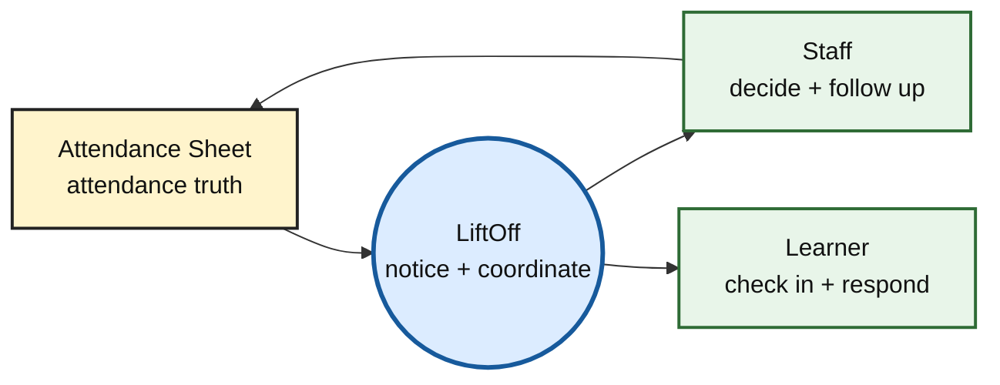
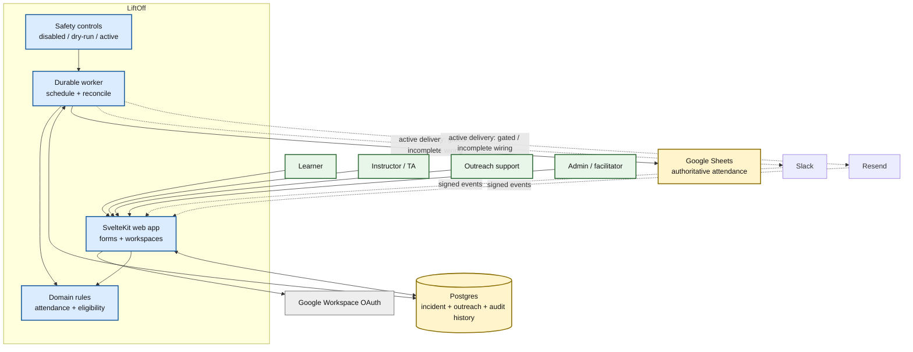
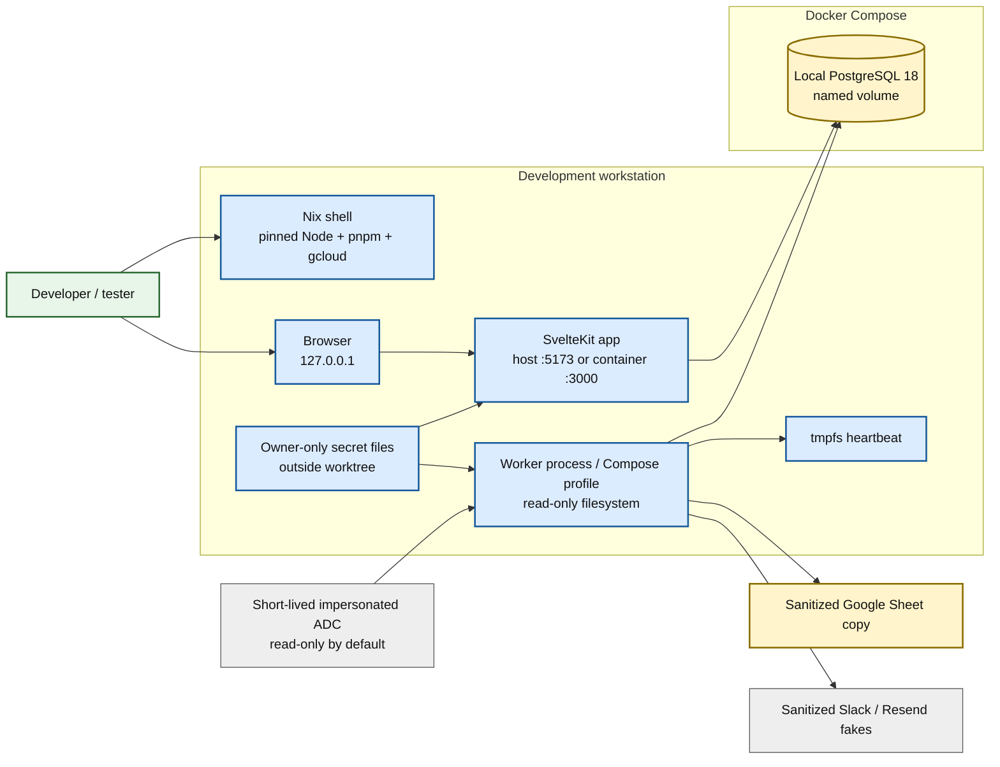
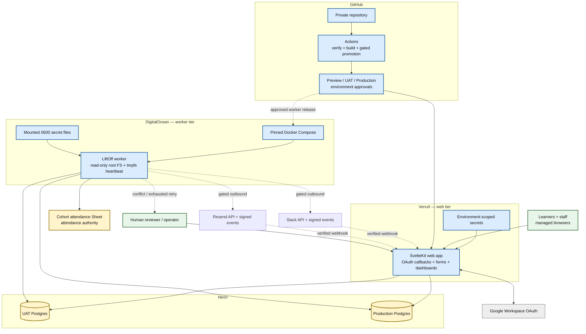
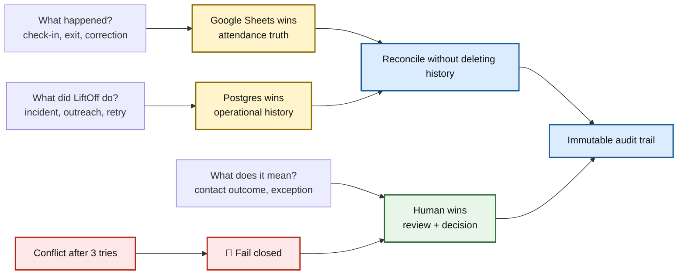
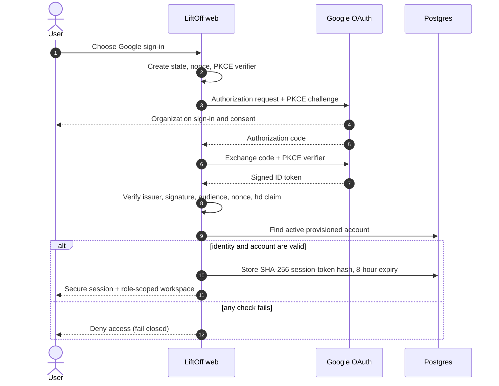
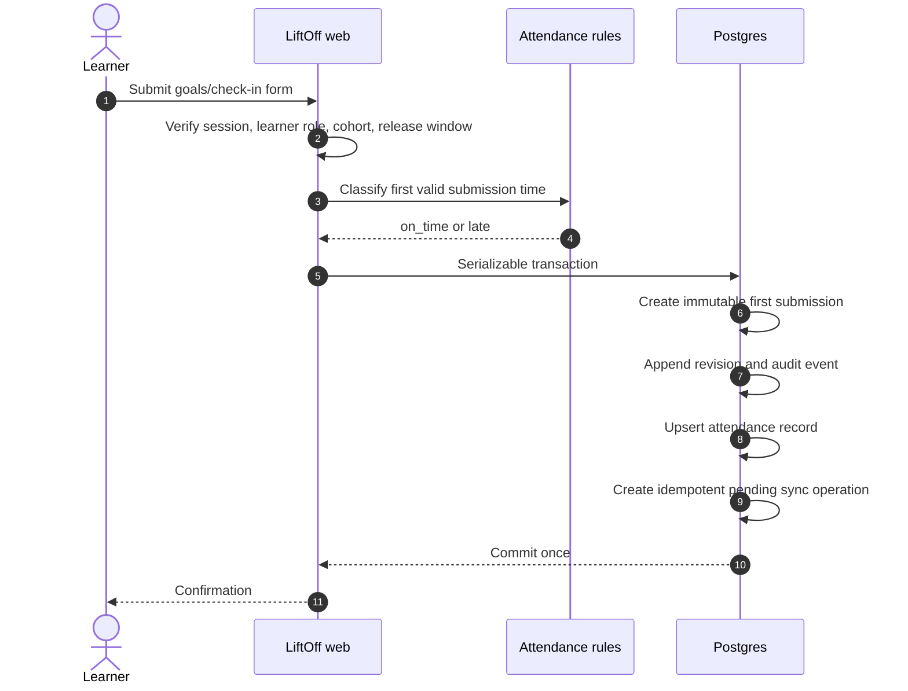
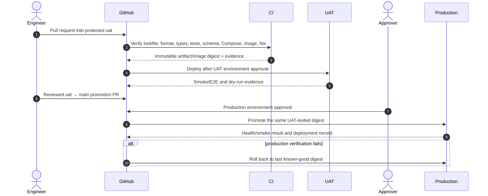

# LiftOff system architecture — a Back of the Napkin view

Status: Architecture baseline with implementation boundaries  
Recorded: 2026-07-18  
Scope: Cohort 3 local development, UAT, production target, and core runtime sequences

## The one-picture idea

LiftOff watches the official attendance record, applies deterministic program rules, and gives staff a safe way to coordinate follow-up without taking authority away from Google Sheets or human reviewers.



## How to read these pictures

The diagrams apply Dan Roam's visual-thinking approach from _The Back of the Napkin_: first look at the available facts, see the important relationships, imagine the clearest framing, and then show only what answers the question. The six visual questions guide the set:

| Question    | Picture used here | What it answers                                                |
| ----------- | ----------------- | -------------------------------------------------------------- |
| Who / what? | Portrait          | Which people and systems participate?                          |
| Where?      | Map               | Where does each component run?                                 |
| How much?   | Status table      | How much is implemented, gated, or undecided?                  |
| When?       | Timeline          | When does the program-day automation act?                      |
| How?        | Flow and sequence | How does a request or incident move?                           |
| Why?        | Authority map     | Why are Sheet, Postgres, and staff responsibilities separated? |

The SQVID choices are deliberately **simple**, **qualitative**, **execution-oriented**, **comparative where status matters**, and focused on **change over time** for sequences. These are working sketches, not exhaustive network or data-model diagrams.

### Visual legend

- Blue boxes: LiftOff components.
- Yellow boxes: authoritative records or managed data stores.
- Green boxes: people.
- Gray boxes: external platforms.
- Solid arrows: implemented local capability.
- Dashed red arrows: target behavior that is gated, externally unvalidated, or still needs production wiring.
- A red stop sign means the system fails closed and asks for human review.

## 1. Who and what — system portrait



## 2. Where — local development map

This is the reproducible development and pilot topology. It keeps provider effects off and uses sanitized data.



### Local safety boundary

```text
real learner data/messages ──X── local tests
live Sheet writes          ──X── ordinary verification
production credentials     ──X── repository and images
sanitized fakes            ───── local tests and dry-run
bounded read-only Sheet    ───── explicitly configured local worker
```

## 3. Where — physical deployment target

The map distinguishes the approved target from what is operational today. The web tier targets Vercel, the durable worker targets DigitalOcean, and Postgres targets Neon. External-effect paths remain dashed until their code wiring, provider validation, compliance review, and activation gates are complete.



### Physical deployment decisions still open

1. Production identity for unattended Google Sheets access is not approved. Development ADC must not be reused. The current key-versus-workload-identity conflict must be resolved and logged as a design decision.
2. Active worker dependencies for Slack, Resend, staff tasks, and writable Sheet outcomes still require implementation and end-to-end tests.
3. GitHub deployment workflows and environment promotion are target architecture; the current workflow validates and builds but does not deploy.
4. UAT and production must use separate Neon branches, provider credentials, recipient mappings, and approvals.

## 4. Why — authority and responsibility map



The separation prevents three common failures: treating an automated inference as attendance truth, erasing deliberate staff corrections, and losing the evidence needed to explain an outreach action.

## 5. When — one program day

```mermaid
flowchart LR
    t0915["9:15\nrelease goals form"] --> t0925["9:25\npre-read + late evaluation"]
    t0925 --> t1045["10:45\npre-read + no-call/no-show"]
    t1045 --> t1100["11:00\nSheet reconciliation"]
    t1100 --> t1445["2:45\nrelease exit ticket"]
    t1445 --> t1500["3:00\nexit reminder"]
    t1500 --> t1515["3:15\nfinal reconcile + incomplete day"]
    t1515 --> t1600["4:00\nowner annotation cutoff"]

    classDef event fill:#dcecff,stroke:#175a9c,stroke-width:2px,color:#111;
    classDef review fill:#e8f5e9,stroke:#2e6b35,stroke-width:2px,color:#111;
    class t0915,t0925,t1045,t1100,t1445,t1500,t1515 event;
    class t1600 review;
```



All times are `America/New_York`; inactive days, federal holidays, blackouts, cohort pauses, and approved individual accommodations suppress the relevant actions without later message backfill.

## 6. How — core sequence diagrams

### A. Google Workspace sign-in

Implemented locally at the contract level; real organization OAuth validation is an activation gate.



### B. Learner morning check-in

Implemented local application behavior.



### C. Dry-run attendance evaluation

Implemented worker behavior; it plans operations but performs no provider call or Sheet write.

```mermaid
sequenceDiagram
    autonumber
    participant Worker
    participant DB as Postgres
    participant Sheet as Google Sheet
    actor Staff

    Worker->>DB: Claim due job conditionally
    Worker->>DB: Read cohort mode, pauses, blackout, session
    alt cohort disabled or action suppressed
        Worker->>DB: Mark job SUPPRESSED + bounded reason
    else cohort dry_run
        Note over Worker,Sheet: Current code records the intended Sheet read; dry-run does not call the provider
        Worker->>DB: Find missing learners and approved template version
        Worker->>DB: Record proposed operations, channels, task/escalation flags
        Worker->>DB: Mark COMPLETED with externalWrites=0, externalMessages=0
        Staff->>DB: Review dry-run evidence in automation workspace
    else active mode today
        Worker->>DB: Route provider job to HUMAN_REVIEW
        Note over Worker,DB: Active provider execution still needs wiring
    end
```

### D. Target active late-to-no-call/no-show flow

This is the approved target sequence, not the current end-to-end implementation. Every external arrow remains blocked until code completion and Gates 1–10 are satisfied.

```mermaid
sequenceDiagram
    autonumber
    participant Worker
    participant Sheet as Google Sheet
    participant DB as Postgres
    participant Slack
    participant Resend
    actor Team as Outreach team

    Worker->>Sheet: Bounded pre-trigger read
    Sheet-->>Worker: Attendance rows + source versions
    Worker->>DB: Reconcile authoritative observations
    Worker->>DB: Upsert one LATE incident + idempotent operations
    Worker-->>Slack: Approved learner DM
    Worker-->>Resend: Approved learner email
    Worker-->>Slack: Staff call task

    alt learner checks in before 10:45
        Worker->>DB: Preserve incident history; record current attendance
    else still missing at 10:45
        Worker->>Sheet: Bounded pre-trigger read
        Worker->>DB: Transition same incident to NO_CALL_NO_SHOW
        Worker-->>Resend: Program Director escalation
    end

    loop at most 3 reminders, one hour apart
        Worker->>DB: Check task claim / acknowledgment
        alt unclaimed
            Worker-->>Slack: Reminder
        else claimed or staff acknowledged
            Worker->>DB: Stop reminder loop
        end
    end

    opt still unresolved after reminder 3
        Worker->>DB: Create unresolved dashboard review
        Team->>DB: Record owner, action, disposition, closure note
    end
```

### E. Sheet reconciliation and conflict handling

Read-only reconciliation is implemented. The selected-outcome write path is contract-tested but still needs active worker wiring and explicit authorization.

```mermaid
sequenceDiagram
    autonumber
    participant Worker
    participant Sheet as Google Sheet
    participant DB as Postgres
    actor Staff

    Worker->>Sheet: Read configured session ranges only
    Sheet-->>Worker: Timestamps, excused state, outcome, source version
    Worker->>DB: Import only missing first timestamps
    Worker->>DB: Apply Sheet-authoritative attendance correction
    Worker->>DB: Preserve blanks and existing history

    opt authorized selected-outcome write
        Worker->>Sheet: Write one configured outcome cell with expected version
        Sheet-->>Worker: Result + observed version
        alt write verified or already idempotent
            Worker->>DB: Mark sync complete
        else staff value or version conflict
            loop maximum 3 attempts
                Worker->>Sheet: Re-read exact cell
                Worker->>DB: Record bounded attempt metadata
            end
            Worker->>DB: Mark HUMAN_REVIEW; preserve Sheet value
            Staff->>DB: Review and resolve without deleting history
        end
    end
```

### F. UAT-to-production promotion

This is the approved delivery sequence. Current CI performs validation and build only; deployment jobs and provider environments are not yet configured.



## 7. How much — readiness at a glance

| Slice                          | Local / contract status                  | Physical / production status                                         |
| ------------------------------ | ---------------------------------------- | -------------------------------------------------------------------- |
| Domain attendance rules        | Implemented and tested                   | Needs UAT evidence                                                   |
| Learner and staff forms        | Implemented locally                      | Real OAuth and deployed role checks pending                          |
| Durable scheduling             | Implemented locally                      | Worker host and operational monitoring pending                       |
| Read-only Sheet reconciliation | Implemented                              | Production identity and workbook validation pending                  |
| Sheet outcome writes           | Adapter and canary contract tested       | Active worker wiring and production canary pending                   |
| Slack / Resend adapters        | Contract tested with sanitized fake HTTP | Worker wiring, provider setup, and non-production validation pending |
| Active incidents and outreach  | Data model and partial operations exist  | End-to-end active execution incomplete                               |
| Dry-run                        | Implemented                              | Pilot and five staff-reviewed live-cohort days pending               |
| Deployment promotion           | CI validation/build exists               | UAT/production deployment workflow and gates pending                 |
| Compliance and activation      | Requirements recorded                    | Review and written go/no-go pending                                  |

## 8. Design rules the pictures preserve

1. Google Sheets is authoritative for attendance and staff corrections.
2. Postgres is authoritative for incident, outreach, synchronization, and audit history.
3. Staff decide ambiguous outcomes; automation never invents an attendance or disciplinary conclusion.
4. All jobs and provider operations use deterministic idempotency boundaries.
5. Three unsuccessful sync/provider attempts produce one human-review path, not an unbounded retry loop.
6. Missing configuration disables capability. It never silently chooses another learner, channel, workbook, or environment.
7. Tests use sanitized fakes and never send real messages or write to a live Sheet.
8. Secrets remain outside the worktree and images; physical environments receive only explicitly scoped secrets.
9. Production promotion uses the exact UAT-tested artifact or image digest.
10. A separate, recorded approval is required before deployment, migration, provider configuration, a live Sheet write, or real outreach.

## References

- Dan Roam, [_The Back of the Napkin_ (Expanded Edition)](https://www.penguinrandomhouse.com/books/300247/the-back-of-the-napkin-expanded-edition-by-dan-roam/).
- [Dan Roam's “The Back of a Napkin” TEDx talk](https://www.ted.com/talks/dan_roam_the_back_of_a_napkin).
- Project authority: [design decisions](./design-decisions.md), [Phase 2](./phase-2.md), [Phase 3](./phase-3.md), [configuration ledger](./project_config.md), and [activation gates](../ACTIVATION-GATES.md).
